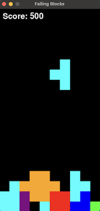

# Falling Blocks - A Human-AI Collaboration

<figure>
  
  <figcaption>Falling Blocks</figcaption>
</figure>


This project is an re-imagination of the classic Tetris® game, developed in Python using the Pygame library. It features core gameplay mechanics such as tetromino falling, rotation, line clearing, and a scoring system. The game ends when the tetrominos stack up to the top of the playing field, with an option to restart once the game is over.

This project was built using the ["Iterative Coding" GPT](https://chat.openai.com/g/g-ZfQ1k76Cv-iterative-coding) developed by vzerox.com to test and demonstrate ChatGPT's ability to generate simple, complete applications and scripts by using an iterative process.

The initial README was also AI-generated. See [iterations/create-readme.md](iterations/create-readme.md).

## Project Description

Falling Blocks was developed iteratively in a human-AI collaboration, utilizing the capabilities of an AI to refine game mechanics, add new features, and ensure a smooth gameplay experience. Each iteration focused on a specific aspect of the game, starting from basic setup to implementing game over logic and a restart feature.

## Installation

To play the Falling Blocks, you'll need Python and Pygame installed on your system.

### Requirements:
- Python 3.11.x
- Pygame

### Installing Pygame

Pygame can be installed via pip. In your terminal or command prompt, run:

```
pip install pygame
```

### Running the Game

To start the game, navigate to the project directory and run:

```
python main.py
```

## How to Play

- **Arrow Left/Right**: Move the tetromino left or right.
- **Arrow Up**: Rotate the tetromino.
- **Arrow Down**: Speed up the tetromino's fall.

The goal is to clear as many lines as possible by completing horizontal lines of blocks without any gaps. The game ends when the blocks reach the top of the board.

## Development Process

The game was developed through a series of iterations, each focusing on adding or refining features. The development was a collaborative effort between a human and an AI, leveraging the AI's ability to generate code and solve programming challenges.

### Tips and Observations
- **ChatGPT does all the coding:** I tried to let ChatGPT do all of the coding, debugging, feature additions, even if they were obvious fixes. This helped ChatGPT maintain the context of the code for future iterations.
- **Maintaining Context** So far it has not lost context across all iterations, even afger refreshing the browser window, switching away to another chat session and returning later, etc.
- **Debug Assistance:** For debugging, as needed, I add print statements and report the debug output (see [iter7.py](iterations/iter7.py)):
    ```
    next iteration: let's discuss piece rotation. when I test the game, this is the first piece that appears:
        [[4, 0, 0],
        [4, 4, 4]],

    when i press the UP arrow. this is the before and after rotation of the piece:
    before: [[4, 0, 0], [4, 4, 4]]
    after: [[4, 0, 0], [4, 4, 4]]

    the piece does not appear to rotate.

    here is the code that rotates the piece:
        def rotate_piece(self):
            print(self.current_piece.shape)
            self.current_piece.rotate()
            print(self.current_piece.shape)

            if self.check_collision(self.current_piece.shape, (self.current_piece.x, self.current_piece.y)):
                self.current_piece.rotate()  # Rotate back if there's a collision

    ```
- In one of the iterations, the fix was so tiny i didn't want to bother with another iteration for it so I made the fix and reported back using the same format that ChatGPT was using for code updates (see [iter10.py](iterations/iter10.py)):
  ```
  User:

  the Game class was missing the 'score' attribute so I added it:

  class Game:
      def __init__(self):
          pygame.init()
          self.screen = pygame.display.set_mode((SCREEN_WIDTH, SCREEN_HEIGHT))
          pygame.display.set_caption('Tetris Clone')
          self.clock = pygame.time.Clock()
          self.board = [[(0,0,0) for _ in range(SCREEN_WIDTH // BLOCK_SIZE)] for _ in range(SCREEN_HEIGHT // BLOCK_SIZE)]
          self.current_piece = self.new_piece()
          self.game_over = False
          self.drop_speed = 1000  # Milliseconds
          self.last_drop_time = pygame.time.get_ticks()
          self.score = 0 # added score and tested the Scoring System. it works!

          # Other methods remain unchanged...
  ```
- I spend no time reviewing the code. I just drop the new code into a new file, run it, and I'm continually surprised when it just works. I will likely stop development when the project gets to a point that ChatGPT can't fix a bug, or add a new feature on it's own.
- **Request entire file or Integration:** If integrating a code update is non-obvious, like an easy copy/paste, I don't waste any time thinking about it, I just ask ChatGPT to generate the entire code block. I suspect this also helps ChatGPT maintain context over time. [See initial_iterations.py Line 246](iterations/initial_iterations.py#246) and [See iter9.py Line 81](iterations/iter9.py#81)
- I had never used Pygame before. I could not not have developed this game on my own in such a short period of time (a few hours end-to-end).

### Iterative Development Overview:

- **Initial Setup (`initial_iterations.py`)**: Establishing the game board, basic tetromino shapes, and movement.
- **Iteration 4 (`iter4.py`)**: Adding game speed control and FPS adjustments.
- **Iteration 5 (`iter5.py`)**: Enhancing collision detection for improved game mechanics.
- **Further Iterations (`iter6.py`, `iter7.py`, etc.)**: Implementing line clearing, scoring, game over detection, and a restart feature.

## Collaborative Human-AI Development

This project showcases the potential of human-AI collaboration in software development. By iteratively refining the game based on AI-generated suggestions and code, we were able to create a feature-complete simple game. This process highlights how AI can assist in problem-solving and creative thinking, contributing to the development of complex projects.

## Files and Iterations

- **[Initial Iterations](iterations/initial_iterations.py)**: The foundation of the game.
- **[Iteration 4](iterations/iter4.py)**: Game speed and FPS adjustments.
- **[Iteration 5](iterations/iter5.py)**: Collision detection improvements.
- **[Further Iterations](iterations/)**: Subsequent files adding additional features.

## License

This project is licensed under the MIT License - see the [LICENSE.md](LICENSE.md) file for details.

## Trademark Acknowledgement

Tetris® is a trademark of The Tetris Company, LLC. This project is an instructional and research-based endeavor, aimed at demonstrating the application of AI in building simple games, and is not endorsed by, directly affiliated with, or sponsored by The Tetris Company, LLC. The use of the "Tetris" name is for descriptive purposes only and not for profit.
